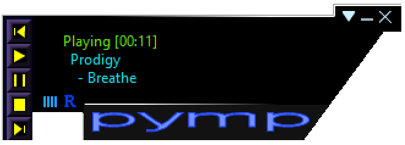
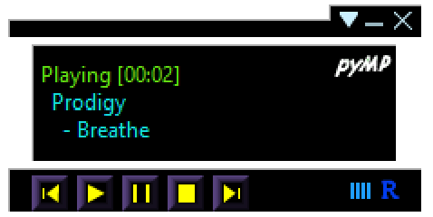
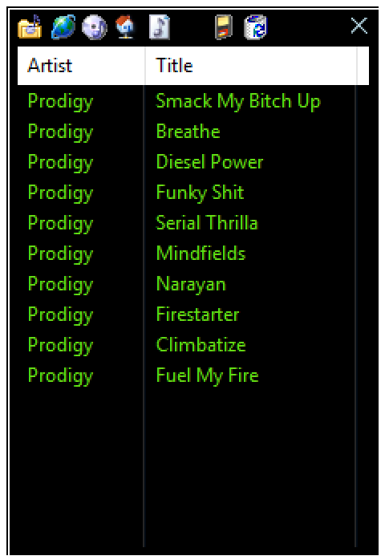

# pyMP - Python Music Player

An asynchronous event-based music player built with Python, wxPython, ffmpeg and pygame-ce.

Initially this project was started by myself back in the early 2000s. Hosted on the defacto open 
source hub at the time - SourceForge. Actually you can still find the original python 2.0 code there:
- [SourceForge pyMP project page](https://sourceforge.net/projects/pyplayer/)

Thought I would bring it back to life and make it available here on GitHub to celebrate the past.

<table>
  <tr>
    <td>
        <a href="screenshots/skin-default.png" target="_blank" rel="noopener noreferrer">
            
        </a>
    </td>
    <td>
        <a href="screenshots/skin-garageinnovation.png" target="_blank" rel="noopener noreferrer">
            
        </a>
    </td>
    <td>
        <a href="screenshots/playlist.png" target="_blank" rel="noopener noreferrer">
            
        </a>
    </td>
  </tr>
  <tr>
    <td>Default Skin</td>
    <td>GarageInnovation Skin</td>
    <td>Playlist</td>
  </tr>
</table>

## Features

- Skinnable GUI with XML-based skin configuration
  - Shaped Windows!
- Playlist management (add files, directories, import/export)
- Global hotkeys for playback control
- Taskbar icon integration
- MP3 playback with ID3 tag support
- HTTP/SHOUTcast/Icecast streaming with ICY metadata (artist/song)
- TCP/IP streaming support
- Configurable settings (skin, hotkeys, stay-on-top, etc.)

## Requirements
The following deps where present during the migration from Python 2 to Python 3 and are required to run the player:

- Python 3.14.6+
- wxPython 4.3.1+
- pygame-ce 2.5.8+ 
  - pygame Community Edition
- ffmpeg
  - Required for HTTP/SHOUTcast/Icecast stream playback
  - Must be installed and available in PATH


Install Python dependencies:

```bash
pip install wxpython pygame-ce
```

Install ffmpeg:

```bash
# Windows (winget)
winget install Gyan.FFmpeg

# Ubuntu/Debian
sudo apt install ffmpeg

# macOS (Homebrew)
brew install ffmpeg
```

## Running

1. Enter the `src` directory
2. Run the player:

```bash
python pymp.py
```

## Hotkeys

| Shortcut | Action |
|----------|--------|
| Ctrl+Shift+P | Play |
| Ctrl+Shift+S | Stop |
| Ctrl+Shift+N | Next track |
| Ctrl+Shift+B | Previous track |
| Ctrl+Shift+W | Pause/Unpause |
| Ctrl+Shift+D | Show/Hide player |

## Project Structure

```
pymp/
├── src/           # Source code
│   ├── pymp.py    # Entry point
│   ├── skin/      # Skin definitions (XML + images)
│   └── ...
├── images/        # Application images
└── doc/           # Documentation
```

## License

GNU General Public License v3.0 - see [LICENSE.txt](LICENSE.txt) for details.
